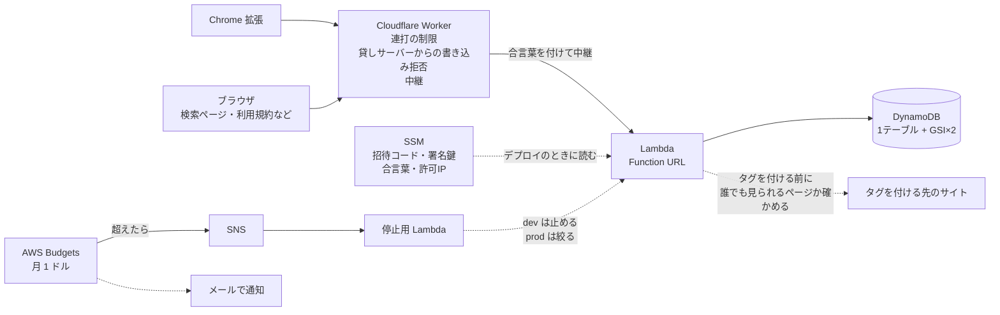
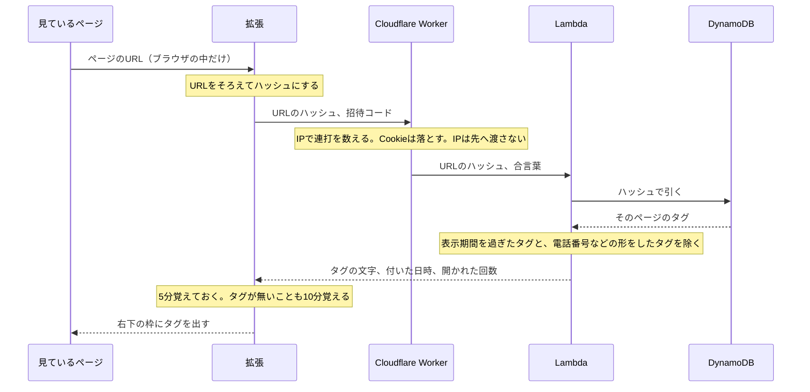
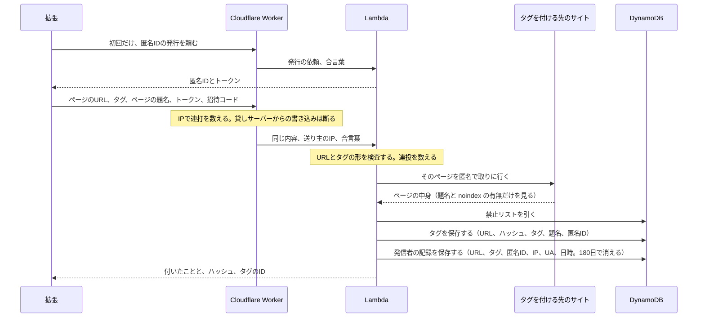
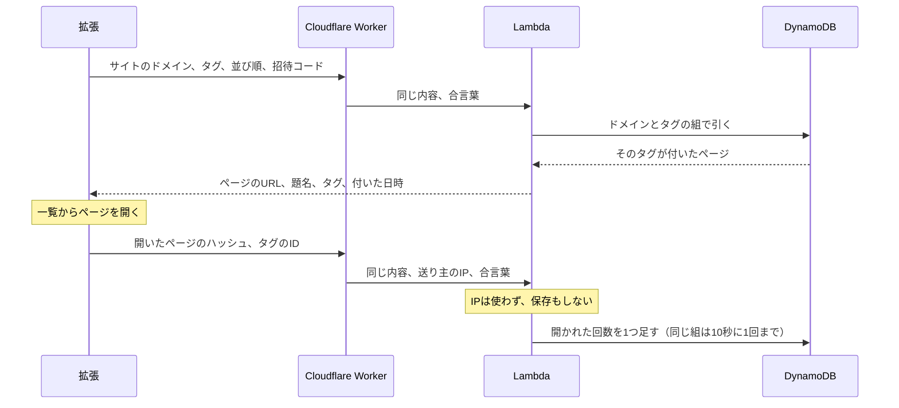

# どゆページ

見ているページに短い言葉（タグ）を付けて、**同じサイトの中から**タグでページを探せるようにする仕組みです。
たとえば釣り動画に「メヒカリ」と付けておくと、あとから`youtube.com` × `メヒカリ`でたどり着けます。

- ほかのサイトのページは出ません（サイトをまたぐ索引を持ちません）。
- 評価や投票の画面は持ちません。並びを決めるのは「検索結果から実際に開かれた回数」だけです。
- 無料で、広告はありません。

## 構成



### データの流れ

どのデータがどこを通り、どこに残るかを、操作ごとに描いています。

タグを見るとき



タグを付けるとき



タグで探すとき



このほかに外へ出るものは次の2つです。

- 集計: 日付・ドメイン・件数を1日1回送ります。URLは含みません。設定で止められます。
- 寄付: 拡張が支払いページ（Stripe）を開くだけです。このサーバーは通りません。

## いまの状態


このリポジトリにあるのはサーバー側です。Chrome拡張と、利用規約などの文面は含みません。
文面は`src/legal/`に`terms.html` `privacy.html` `takedown.html` `transmission.html`を置くと、そのまま返ります。
コメントにある`docs/04 §7`のような番号は設計メモのもので、メモもここには含みません。

- 接続先（LambdaのFunction URL）・招待コード・署名鍵はリポジトリに置きません。SSMとWorkerの秘密に入れてあります。
- 利用規約などのページはLambdaが直接返します。対象は`/terms` `/privacy` `/takedown` `/transmission` `/source` `/license`で、招待コードなしで読めます。

## API

招待コードは`x-doyu-invite`、トークンは`x-doyu-token`で渡します。招待コードが未設定のステージでは不要です。

| | 要るもの | 内容 |
|---|---|---|
| `GET /v1/params` | 招待コード | `norm_v`・`deny_version`・`read_key` |
| `GET /v1/norm-rules` | 招待コード | URLをそろえるルール（JSON。正規表現は配らない） |
| `GET /v1/normalize.mjs` | なし | ↑を解釈する唯一の実装。サーバーと拡張が同じものを使う |
| `POST /v1/hello` | 招待コード | 匿名IDとトークンの発行 |
| `GET /v1/tags?hash=` | 招待コード | そのページのタグ。URLのハッシュで引く。付けた人・URL・IPは返さない |
| `POST /v1/tags` | ＋トークン | タグを付ける |
| `POST /v1/tags/undo` | ＋トークン | 自分が今付けたタグを取り消す（60秒以内） |
| `GET /v1/search?domain=&tag=&order=` | 招待コード | サイト内検索。`order`は`newest`（既定）か`popular` |
| `POST /v1/reach` | 招待コード | 検索結果からページを開いたことの記録。人気順と表示期間に使う |
| `POST /v1/kpi` | ＋トークン | 日ごとの集計（日付・サイト・件数。URLを含まない） |
| `GET /` `GET /search` | なし | 検索ページ（`noindex`） |
| `GET /api/health` | なし | 稼働中のバージョンとソースの場所 |

### タグを付けるときの検査（`src/tags.mjs`の`postTag`）

1. URLをそろえます（`www.`と`#`以降を落とすだけです）。
2. 付けてはいけないURLを断ります（社内向け・役所・合言葉を含むURL・共有リンクなど。`src/blocklist.mjs`）。
3. タグの形を検査します（30文字まで。電話番号・メール・URL・7桁以上の数字・住所は断ります。`src/format-deny.mjs`）。
4. 連投を止めます（1分に5件。10分で40件を超えたら30分止めます）。
5. 誰でも見られるページかを実際に見に行きます（ログイン必須のページと`noindex`のページは断ります。短縮URLはここで展開されます。`src/publicity.mjs`）。
6. 禁止リスト（タグ・サイト・URL）に当たれば断ります。
7. 同じページに1つの匿名IDから付けられるのは10個までです。
8. 保存し、発信者の記録（IP・UA・日時）を残します。

### 読むとき

- 読み取りではIPを見ず、Cookieも使いません。記録が残るのは書き込みだけです。
- 付いてから14日は必ず表示します。そのあとは、最後に開かれてから180日だけ表示します。
- 表示から外れたタグも検索には出ます。検索からも消えるのは、管理者が削除したときだけです。
- 人気順は、開かれた回数を60日で半分になる重みで数えます（`src/rank.mjs`）。

## 開発

```bash
npm install
npm test              # 単体テスト（メモリ実装）
                      # ※ テストファイルを足したら package.json の test に追記すること
                      #   （node --test にディレクトリを渡すと Node 22 で解決に失敗する）
npm run ddb:up        # DynamoDB Local を起動（Docker）
npm run test:ddb      # DynamoDB Local に対するテスト
npm run dev           # http://localhost:3000
npm run ddb:down

npm run gen-psl       # Public Suffix List を取り直して同梱データを更新（年1回程度）
```

Dockerが無い環境では、DynamoDB Localのjarを直接動かしてもかまいません。
```bash
java -Djava.library.path=./DynamoDBLocal_lib -jar DynamoDBLocal.jar -inMemory -sharedDb -port 8000
```

**メモリ実装ではGSI・条件付き書き込み・TTL・`ReturnValues`を検証できません**。
そのため、データ層を触るときは必ず`test:ddb`を通してください。

## 変えると動かなくなるもの

| 項目 | 値 | 変えるとどうなるか |
|---|---|---|
| 拡張ID | `fladmnjffgaplkjhjnhfgifbmcdcoldj`（`scripts/config.mjs`） | CORSで許可する相手。自分の拡張のIDに変える |
| テーブル | `doyu-<stage>-main`（PK `pk` / SK `sk`） | |
| GSI1 | `gsi1pk` / `s`（人気順） | |
| GSI2 | `gsi2pk` / `created_at`（新着順） | |
| 容量 | dev 4/4、prod 15/13（RCU/WCUの合計） | 無料枠はアカウント合計で25/25 |
| URLのそろえ方 | 全サイト共通の1ルール（`src/data/norm-rules.json`、`norm_v` = 2） | 既存の`url_hash`が全部変わる |
| `tag_id` | `base32(sha256(NFKC＋小文字化した文字列)[0:10])` | 既存データが全部引けなくなる（`test/tag.test.mjs`が固定） |
| 二次利用の許諾 | 利用規約に置く | 最初の投稿より前にしか置けない |

ステージごとの値は、SSMの`/doyu/<stage>/`の下に次の名前で置きます。

`allowed-ips` `invite-code` `token-secret` `origin-secret` `origin-enforce`


## 運営の道具

```bash
doyu.bat                         # Windows。タグの中身を見る・消す・隠す・戻す・禁止リスト（scripts/admin.mjs）
STAGE=<stage> npm run infra      # テーブル・ロールを作る
STAGE=<stage> npm run deploy     # 手元から出すのは dev だけ
STAGE=<stage> npm run smoke      # 動作確認
ALERT_EMAIL=<通知先> npm run guard   # 月$1を超えたらメール。dev は止め、prod は絞る
npm run resume                   # 自動停止からの再開
```


## ライセンス

[PolyForm Shield License 1.0.0](LICENSE)です。読むこと・手元で動かすこと・改変することはできますが、
どゆページと競合するサービスの提供には使えません。貢献するときは[CONTRIBUTING.md](CONTRIBUTING.md)と[CLA.md](CLA.md)を読んでください。
