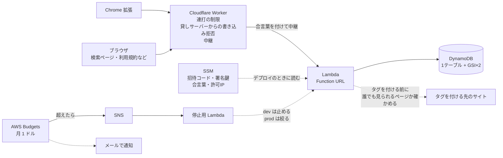

# どゆページ

見ているページに短い言葉（タグ）を付けて、**同じサイトの中から**タグでページを探せるようにする仕組み。
例: 釣り動画に「メヒカリ」と付けておくと、あとから `youtube.com` × `メヒカリ` でたどり着ける。

- ほかのサイトのページは出ない（サイトをまたぐ索引を持たない）
- 評価や投票の画面は持たない。並びを決めるのは「検索結果から実際に開かれた回数」だけ
- 無料・広告なし

## 構成



## いまの状態


このリポジトリにあるのはサーバー側。Chrome 拡張と、利用規約などの文面は含まない。
文面は `src/legal/` に `terms.html` `privacy.html` `takedown.html` `transmission.html` を置くと、そのまま返る。
コメントにある `docs/04 §7` のような番号は設計メモのもので、メモもここには含まない。

- 接続先（Lambda の Function URL）・招待コード・署名鍵はリポジトリに置かない。SSM と Worker の秘密に入れてある
- 利用規約などのページは Lambda が直接返す: `/terms` `/privacy` `/takedown` `/transmission` `/source` `/license`
  （招待コードなしで読める）

## API

招待コードは `x-doyu-invite`、トークンは `x-doyu-token` で渡す。招待コードが未設定のステージでは不要。

| | 要るもの | 内容 |
|---|---|---|
| `GET /v1/params` | 招待コード | `norm_v`・`deny_version`・`read_key` |
| `GET /v1/norm-rules` | 招待コード | URL をそろえるルール（JSON。正規表現は配らない） |
| `GET /v1/normalize.mjs` | なし | ↑を解釈する唯一の実装。サーバーと拡張が同じものを使う |
| `POST /v1/hello` | 招待コード | 匿名IDとトークンの発行 |
| `GET /v1/tags?hash=` | 招待コード | そのページのタグ。URL のハッシュで引く。付けた人・URL・IP は返さない |
| `POST /v1/tags` | ＋トークン | タグを付ける |
| `POST /v1/tags/undo` | ＋トークン | 自分が今付けたタグを取り消す（60秒以内） |
| `GET /v1/search?domain=&tag=&order=` | 招待コード | サイト内検索。`order` は `newest`（既定）か `popular` |
| `POST /v1/reach` | 招待コード | 検索結果からページを開いたことの記録。人気順と表示期間に効く |
| `POST /v1/kpi` | ＋トークン | 日ごとの集計（日付・サイト・件数。URL を含まない） |
| `GET /` `GET /search` | なし | 検索ページ（`noindex`） |
| `GET /api/health` | なし | 稼働中のバージョンとソースの場所 |

### タグを付けるときの検査（`src/tags.mjs` の `postTag`）

1. URL をそろえる（`www.` と `#` 以降を落とすだけ）
2. 付けてはいけない URL を断る（社内向け・役所・合言葉を含む URL・共有リンクなど。`src/blocklist.mjs`）
3. タグの形を検査する（30文字まで。電話番号・メール・URL・7桁以上の数字・住所は断る。`src/format-deny.mjs`）
4. 連投を止める（1分に5件。10分で40件を超えたら30分止める）
5. 誰でも見られるページかを実際に見に行く（ログイン必須・`noindex` は断る。短縮 URL はここで展開される。`src/publicity.mjs`）
6. 禁止リスト（タグ・サイト・URL）に当たれば断る
7. 同じページに1つの匿名IDから付けられるのは10個まで
8. 保存し、発信者の記録（IP・UA・日時）を残す

### 読むとき

- 読み取りは IP を見ず、Cookie も使わない。記録が残るのは書き込みだけ
- 付いてから14日は必ず表示する。そのあとは、最後に開かれてから180日だけ表示する
- 表示から外れたタグも検索には出る。検索からも消えるのは、管理者が削除したときだけ
- 人気順は、開かれた回数を60日で半分になる重みで数える（`src/rank.mjs`）

## 開発

```bash
npm install
npm test              # 単体テスト（メモリ実装）
                      # ※ テストファイルを足したら package.json の test に追記すること
                      #   （node --test にディレクトリを渡すと Node 22 で解決に失敗する）
npm run ddb:up        # DynamoDB Local を起動（Docker）
npm run test:ddb      # DynamoDB Local に対するテスト
npm run dev           # http://localhost:3000
npm run ddb:down

npm run gen-psl       # Public Suffix List を取り直して同梱データを更新（年1回程度）
```

Docker が無い環境では DynamoDB Local の jar を直接動かしてもよい:
```bash
java -Djava.library.path=./DynamoDBLocal_lib -jar DynamoDBLocal.jar -inMemory -sharedDb -port 8000
```

**メモリ実装では GSI・条件付き書き込み・TTL・`ReturnValues` を検証できない**ので、
データ層を触るときは必ず `test:ddb` を通すこと。

## 変えると壊れるもの

| 項目 | 値 | 変えるとどうなるか |
|---|---|---|
| 拡張ID | `fladmnjffgaplkjhjnhfgifbmcdcoldj`（`scripts/config.mjs`） | CORS で許可する相手。自分の拡張の ID に変える |
| テーブル | `doyu-<stage>-main`（PK `pk` / SK `sk`） | |
| GSI1 | `gsi1pk` / `s`（人気順） | |
| GSI2 | `gsi2pk` / `created_at`（新着順） | |
| 容量 | dev 4/4、prod 15/13（RCU/WCU の合計） | 無料枠はアカウント合計で 25/25 |
| URL のそろえ方 | 全サイト共通の1ルール（`src/data/norm-rules.json`、`norm_v` = 2） | 既存の `url_hash` が全部変わる |
| `tag_id` | `base32(sha256(NFKC＋小文字化した文字列)[0:10])` | 既存データが全部引けなくなる（`test/tag.test.mjs` が固定） |
| 二次利用の許諾 | 利用規約に置く | 最初の投稿より前にしか置けない |

ステージごとの値は SSM の `/doyu/<stage>/` に置く:
`allowed-ips` `invite-code` `token-secret` `origin-secret` `origin-enforce`


## 運営の道具

```bash
doyu.bat                         # Windows。タグの中身を見る・消す・隠す・戻す・禁止リスト（scripts/admin.mjs）
STAGE=<stage> npm run infra      # テーブル・ロールを作る
STAGE=<stage> npm run deploy     # 手元から出すのは dev だけ
STAGE=<stage> npm run smoke      # 動作確認
ALERT_EMAIL=<通知先> npm run guard   # 月$1を超えたらメール。dev は止め、prod は絞る
npm run resume                   # 自動停止からの再開
```


## ライセンス

[PolyForm Shield License 1.0.0](LICENSE)。読む・手元で動かす・改変することはできるが、
どゆページと競合するサービスの提供には使えない。貢献するときは [CONTRIBUTING.md](CONTRIBUTING.md) と [CLA.md](CLA.md) を読んでください。
